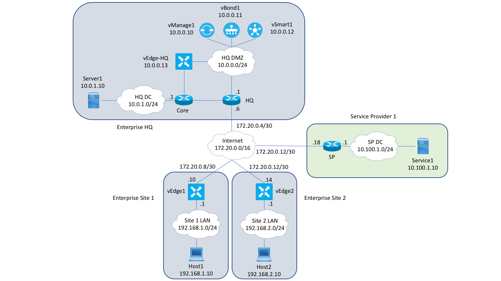

# Viptela Automation Workshop

This is the network automation version of the [Viptela SDX Workshop](README.md).  It is not meant to be an exhaustive treatment
of any of the technologies presented, but an application of those technologies to a real-world use case for automation.  In order
to get the most from this workshop, we recommend these [pre-requisites](pre-requisites.md) from [Cisco DevNet](https://developer.cisco.com/).

## Requirements

* [virlutils](https://github.com/CiscoDevNet/virlutils)
* A Viptela license file and the Organization name associated with that license file.  The Organization name should be provided where you see: `<your org name>`

## Cloning this repo:

`git clone https://github.com/ciscops/viptela-workshop.git --recursive`

For more help with git, see DevNet's [A Brief Introduction to Git](https://learninglabs.cisco.com/lab/git-basic-workflows/step/1)

## Purpose
The purpose of this workshop is to augment the current dCloud offerings with a "from scratch" experience of the following:
* Setting up the Viptela control plane from scratch
* Using Enterprise certificates
* Bringing up the Viptela Overlay Network from scratch
* Integrating the Viptela Overlay Network with traditional infrastructure
* Setting up some common routing options
* Deploying template for automation

## Topology



## Scenario
Enterprise has a single HQ and two remote sites.  All routing at the remote sites is handled by the vEdge.  The HQ does full internet peering, so the vEdge there is in a DMZ and exchanges routes with the HQ Core router via OSPF.

The Viptela control plane (i.e. vmanage1, vbond1, vsmart1) is hosted in the DMZ at the enterprise HQ.

### Network Setup
Since this is being done in VIRL, the first interface all of devices have a connection to the `flat` management network.  The subsequent interfaces are put into the simulated network.  For Viptela, the management interfaces are moved to VPN 512 to simulate OOB management access.  The following networks are allocated to the topology:

* 192.168.0.0/16: Enterprise private
  * 192.168.1.0/24: Enterprise Site 1
  * 192.168.2.0/24: Enterprise Site 2
  * 192.168.255.0/24: Enterprise Loopbacks/TLOCS
* 10.0.0.0/8: Enterprise routable
  * 10.0.0.0/24: Enterprise HQ DMZ
  * 10.0.1.0/24: Enterprise HQ DC
  * 10.0.255.0/24: Enterprise HQ P-T-P links
* 172.20.0.0/16: Internet Core

### Test Nodes
There are several nodes in the topology that can be used for testing:
* server1: A server sitting in the HQ data center that can be reached both internally from within the enterprise and externally.
* service1: A server sitting in an SP data center that represents a service that is not associated with the Enterprise.
* host1/2: These hosts are sitting internal to the enterprise.

_The default username/password is `admin/admin`_

## Deploy Topology

_NOTE: The Topology requires images for vmanage, vbond, vsmart, vedge, and CSR1000v_

### To deploy with virlutils

Install [virlutils](https://github.com/CiscoDevNet/virlutils)

Create a .virlrc:
```
VIRL_USERNAME=guest
VIRL_PASSWORD=guest
VIRL_HOST=your.virl.server
```

## Network Automation Exercises

### Section 01 - Spinning up the Workshop topology in VIRL
- [Exercise 1.0 - Building the topology](./exercises/1-0/README.md)
- [Exercise 1.1 - Exploring the workshop environment](./exercises/1-1/README.md)

### Section 02 - Using Ansible to gather facts from network devices
- [Exercise 2.0 - Writing your first playbook](./exercises/2-0/README.md)
- [Exercise 2.1 - Module documentation, Registering output & tags](./exercises/2-1/README.md)

### Section 03 - Using Ansible to backup, and restore
- [Exercise 3.0 - Backing up the router configuration](./exercises/3-0/README.md)
- [Exercise 3.1 - Restoring the backed up configuration](./exercises/3-1/README.md)

### Section 04 - Using Ansible to configure via CLI
- [Exercise 4.0 - Configure the router configurations using CLI](./exercises/4-0/README.md)

### Section 05 - Bring up the Viptela Overlay Network
- [Exercise 5.0 - Bring up the Viptela Control Plane](./exercises/5-0/README.md)
- [Exercise 5.1 - Exercising the vManage REST API](./exercises/5-1/README.md)
- [Exercise 5.2 - Bring up the Viptela Edge](./exercises/5-2/README.md)

### Section 06 - Advanced Concepts
- [Exercise 6.0 - Configure the router configurations using NETCONF](./exercises/6-0/README.md)
- [Exercise 6.1 - Configure the router configurations using RESTCONF](./exercises/6-1/README.md)
- [Exercise 6.2 - An introduction to templating with Jinja2](./exercises/6-2/README.md)
- [Exercise 6.3 - Parsing unstructured data with TextFSM](./exercises/6-3/README.md)
- [Exercise 6.4 - Adding idempotency to REST operations](./exercises/6-4/README.md)
- [Exercise 6.5 - An introduction to Roles](./exercises/6-5/README.md)

### Section 07 - Clean up the workshop topology
- [Exercise 7.0 - Clean up the workshop topology](./exercises/7-0/README.md)

## Additional information
 - [Network Automation with Ansible Homepage](https://www.ansible.com/network-automation)
 - [List of Networking Ansible Modules](http://docs.ansible.com/ansible/latest/list_of_network_modules.html)
 - [Module Maintenance & Support](http://docs.ansible.com/ansible/latest/modules_support.html)

---